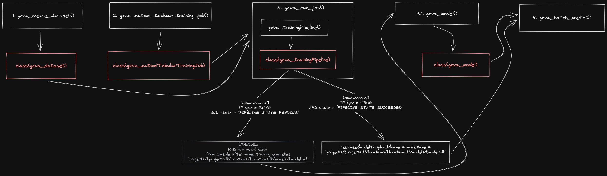

# googleCloudVertexAIR

An R interface to [Vertex AI](https://cloud.google.com/vertex-ai)

Vertex AI REST API documentation [here](https://cloud.google.com/vertex-ai/docs/reference/rest)

**Status:** This is experimental and not recommended for production use yet

## Installation 

### CRAN (production)

This package is not yet available on CRAN. 

### GitHub (development)

To install the latest, potentially unstable version directly from GitHub:

```r
if(!require("remotes")){
    install.packages("remotes")
}
remotes::install_github("justinjm/googleCloudVertexAIR")
```

## Getting Started 

Please see the package site here for more information and examples.

## Function Reference Diagram

Here's a visualization of the package's function and how they work together:


